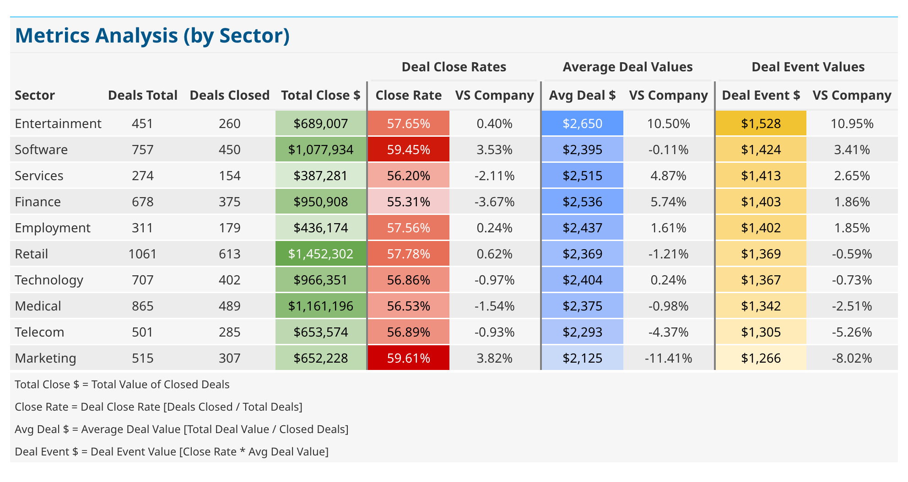
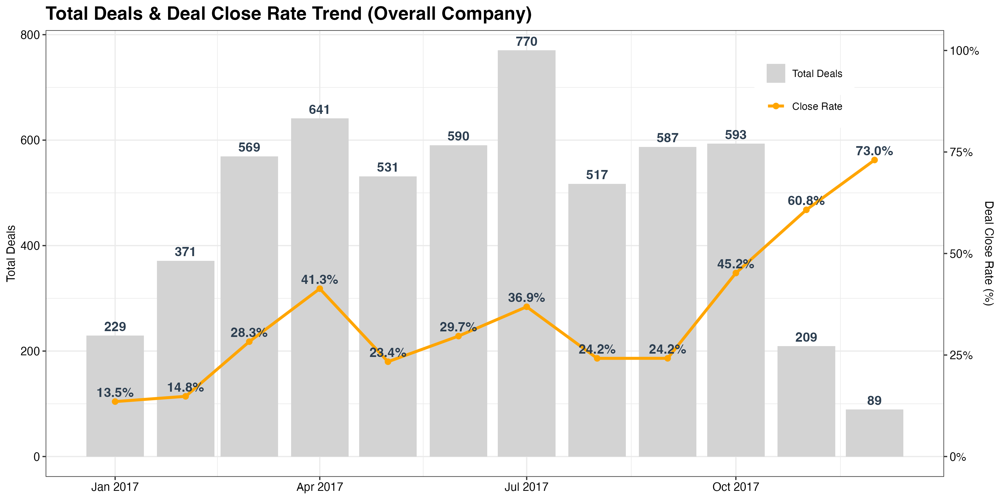
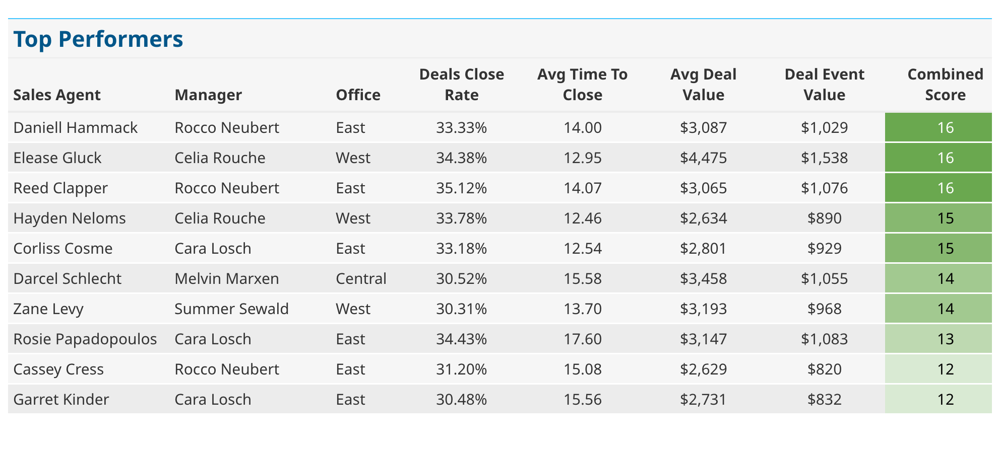
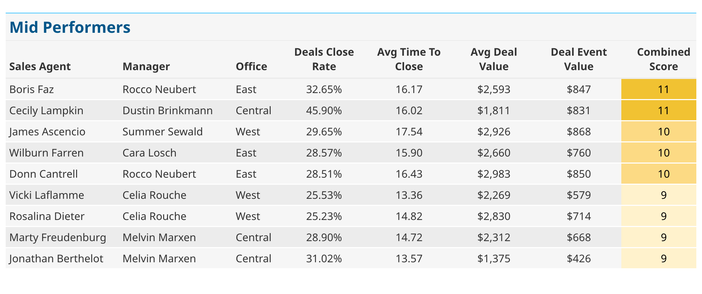
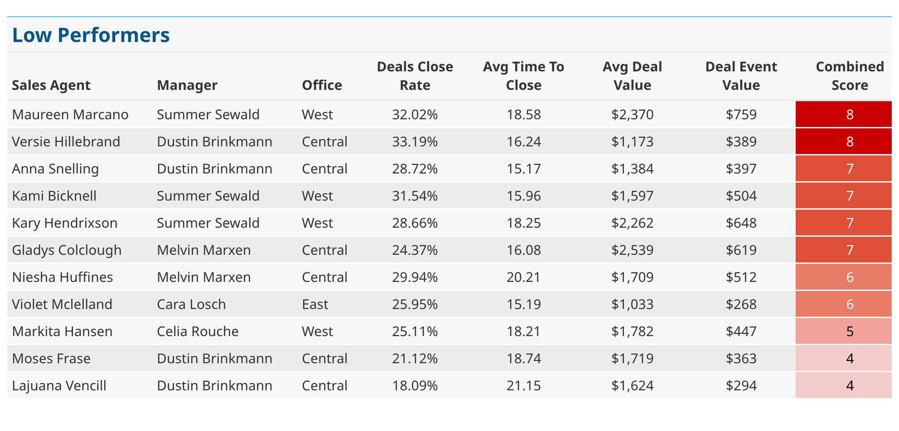

CRM DATA ANALYSIS PROJECT
---

## Overview
This project involves a detailed analysis of CRM data from a company selling computer hardware. The primary focus was on establishing performance benchmarks, understanding sales trends, and segmenting customers to enhance sales and marketing strategies.

Checkout the full analysis write up on Medium. 

---

## Objectives
Analyze Key Metrics: Deal Close Rate, Average Deal Value, and Average Deal Event Value.
Segmentation: Evaluate data across various segments, including sector, employee size, and regional office.
Trend Analysis: Identify patterns over time to understand the effectiveness of sales strategies.

---

## Methodology
Metrics were calculated for individual sales representatives and segmented based on:

* Sectors: Technology, Medical, Marketing, etc.
* Employee Size: Ranging from small (0-1000 employees) to large (10,000+ employees).
* Regional Offices: East, Central, West.

Quantiles were used to categorize sales reps into top, mid, and low performers based on a combined score of the metrics. Trends over time were also analyzed, with the last two months excluded from trend data due to incomplete deal closures.

Metrics analyzed include:

* Deal Close Rate: Percentage of deals closed by a sales rep.
* Average Deal Value: Average value of deals closed by a sales rep.
* Average Deal Event Value: Average value of deal events (meetings, calls, etc.) leading to a deal closure.
* Average Time to Close: Average time (in days) taken to close a deal.

---

## Summary of Insights

* Retail, Medical and Software sectors account for 44% of all deals generated. 

{width=90% fig-align=center}

* Although Marketing has the highest Deal Close Rate, Entertainment and Software sectors
generate the highest value per deal.

{width=90% fig-align=center}

* Majority of Deals are closed within 0 - 30 days.

{width=100% fig-align=center}

* Seasonal trends observed in term of Total Deals, with increasing Total Deals in 
Q2 and Q4, with a peak in July:

{width=90% fig-align=center}

* Sales Reps can be categorized into Top, Mid, and Low performers based on a combined score of metrics.
However given the limitation of the dataset, we cannot really determine drivers of performance.

{width=90% fig-align=center}

{width=90% fig-align=center}

{width=90% fig-align=center}

See more details in full article. 

---

## Analysis Limitations

* Data Completeness: Exclusion of the latest data might omit recent trends and performances.
* Lack of Context: Absence of detailed business strategy and market conditions may limit the depth of analysis.

---

## Tools of the Trade

- **<a href="https://www.tidyverse.org/" target="_blank">tidyverse</a>**: An integrated collection of R packages designed to make data science faster, easier, and more fun.
- **<a href="https://sfirke.github.io/janitor/" target="_blank">janitor</a>**: A package that provides simple functions for examining and cleaning dirty data.
- **<a href="https://lubridate.tidyverse.org/" target="_blank">lubridate</a>**: Facilitates working with dates and times in R, making it easier to perform date calculations and parsing.
- **<a href="https://rlang.r-lib.org/" target="_blank">rlang</a>**: A toolbox for working with base R's non-standard evaluation, providing tools for programming with data structures.
- **<a href="https://yutannihilation.github.io/allYourFigureAreBelongToUs/ggthemes/" target="_blank">ggthemes</a>**: Provides additional themes and scales to enhance the visual presentation of graphics made with ggplot2.
- **<a href="https://gt.rstudio.com/" target="_blank">gt</a>**: An R package designed to create beautiful, flexible, table outputs from R.
- **<a href="https://jthomasmock.github.io/gtExtras/" target="_blank">gtExtras</a>**: Extends the `gt` package by adding support for additional stylings, themes, and useful functionalities in creating tables.

---
