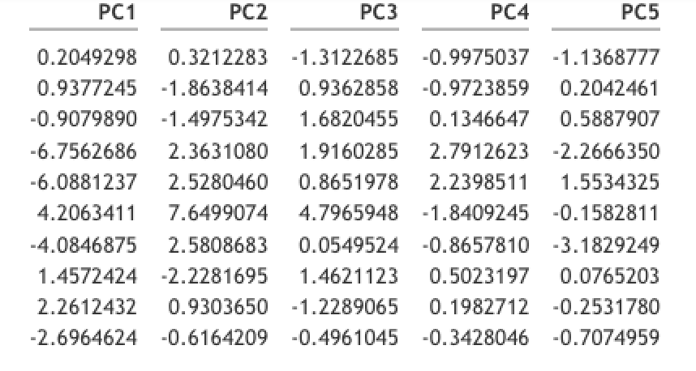
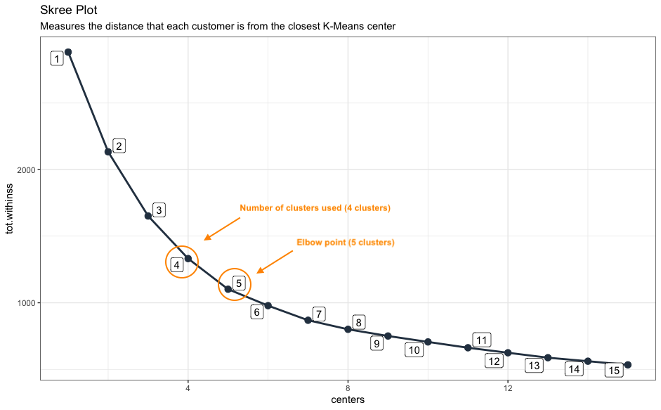
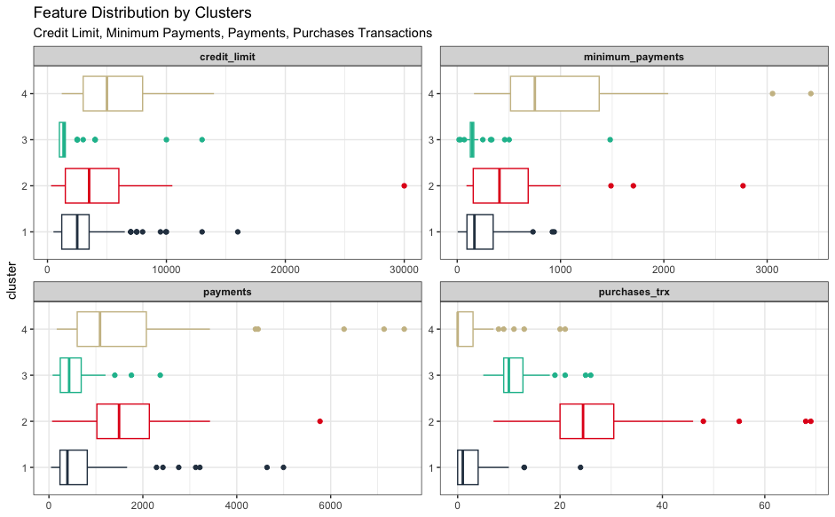

```{r setup, include=FALSE, warning=FALSE, comment=FALSE}
knitr::opts_chunk$set(echo = TRUE, dpi = 300)
```

```{r echo=FALSE, include=FALSE}

# SETUP ----

# Data Import

# * Set Working Dir ----
setwd(here::here("customer_segmentation_banking", "analysis"))

# * Libraries ----
library(tidyverse)
library(janitor)
library(tidymodels)
library(tidyquant)

# * Data Import ----
customer_tbl <- read_csv("../data/Marketing_data.csv") %>% 
    clean_names() %>% 
    as_tibble()
```

\newpage

## __Problem Statement__

The banking industry struggles with understanding and meeting the diverse needs of customers, 
resulting in generic marketing approaches to financial product offerings that fall short of 
creating personalized experiences. To address this challenge, a data-driven solution is 
required to effectively segment customers and create targeted personas for improved customer 
engagement and satisfaction, thus leading to increased revenue for banks/financial institutions.


### __Solution__

Customer segmentation can be achieved through the powerful **k-means** algorithm. 
By leveraging data analytics and machine learning techniques, financial institutions 
, including banks and credit card companies, gain valuable insights into customer behavior, preferences, 
and characteristics. This enables the identification of distinct customer segments 
and the development of personalized offerings. This has several advantages including
enhanced customer understanding, improved customer engagement with product offerings, a healthier
customer base, and increased revenue for financial institutions. 


### __Implementation Strategy__
To implement customer segmentation using the k-means algorithm, financial institutions should follow these steps:

1. Data Collection and Integration: Gather customer data from various sources, including transaction records, demographic information, and customer interactions.

2. Preprocessing and Feature Selection: Cleanse and preprocess the data, selecting relevant features for analysis, such as transaction frequency, average balance, age, and customer preferences.

3. K-Means Clustering: Apply the k-means algorithm to segment customers based on similar behavioral patterns. Determine the optimal number of clusters and assign customers to their respective segments.

4. Persona Creation: Develop personas for each customer segment, incorporating demographic information, behaviors, preferences, and goals. These personas should be representative of the segment's characteristics and serve as a guide for targeted marketing strategies.

5. Implementation and Iteration: Implement personalized marketing campaigns and track the performance of the tailored strategies. Continuously evaluate and refine the segments and personas based on customer feedback and evolving market dynamics.

The following pages, walk through a detailed case study of customer segmentation and 
persona creation using the k-means algorithm.

__Disclaimer:__ Please note that the author of this analysis is not a banking/financial industry expert. This data analysis project is based on a general understanding of customer analytics. The recommendations provided regarding financial products are based on online research. Implementing these recommendations in the real world requires expert opinion and consideration of specific regulatory, market, and business factors.

\newpage


## __Introduction__

In today's competitive marketplace, financial institutions must focus on developing effective strategies 
to attract and retain customers. One key approach to customer targeting is customer segmentation, which involves dividing a customer base into groups based on shared characteristics or needs. By understanding the unique needs and preferences of different customer segments, financial institutions can tailor their marketing efforts, product offerings, and customer service to better meet the expectations of each group. This analysis will explore how to use customer data to segment customers in the banking and credit card industry and provide insights on how financial institutions can effectively segment their customer base to drive growth, profitability and create a win-win strategy for themselves and their customers. 

Creating a win-win strategy for any business and its customers is crucial for maintaining a long-term, mutually beneficial relationship. In today's marketplace, customers have more choices than ever before, and they are more empowered to switch to a competitor if they feel that their needs are not being met. Therefore, it is in the best interest of financial institutions to ensure that their customers feel satisfied and valued. By creating a win-win strategy, financial institutions can achieve their business objectives while also addressing the needs and preferences of their customers. This can result in increased customer loyalty, higher retention rates, and ultimately, greater profitability for the business. Additionally, a win-win strategy can help to foster a positive reputation and brand image, which can attract new customers and enhance the overall success of the organization. What does a win-win strategy for financial institutions look like?

* Providing personalized services: This can create a win-win situation by offering customized products and services that cater to the specific needs of individual customers. For example, offering credit cards with rewards and benefits that are tailored to a customer's spending habits and preferences.

* Maintaining transparency: It is important for financial institutions to be transparent about their policies, fees, and charges. This can help to build trust and confidence with customers and ensure that they feel valued and respected.

* Offering competitive rates and terms: Financial institutions can attract and retain customers by offering competitive rates and terms on their products and services. This can help to ensure that customers feel that they are getting good value for their money.

* Providing excellent customer service: Customer service is a key factor in creating a win-win strategy. Financial institutions that provide excellent customer service can differentiate themselves from competitors and build strong relationships with their customers.

In general, a win-win strategy must ensure that customers are able to get access to
the credit they need at reasonable terms and conditions to reduce their risk of 
default, which in turn reduces the risk to the financial institutions.

\newpage

## __Analysis Approach__

The analysis approach involves several steps, starting with explanatory data analysis 
to gain insights into the data. Next, the k-means algorithm is used to identify clusters 
in the data based on shared characteristics of customers. The UMAP algorithm is then used 
to plot the clusters in two dimension, making it easier to visualize the clusters. 
The analysis of the clusters is then performed to understand the unique characteristics and 
needs of each group and then create customer personas. Finally, based on the insights gained, 
recommendations on product offerings are made to address the needs of each cluster/persona and 
improve the overall customer experience. This approach can be used in a variety of industries 
to better understand customer behavior and tailor services and products to meet their needs.

__Note:__ All analysis are performed using the R programming language.

---

## __Data Understanding__

The dataset used in this is part of the resource files for the Udemy course
[Data Science for Business](https://www.udemy.com/course/data-science-for-business-6-real-world-case-studies/). See data descriptions below - 

* **CUST_ID**: Identification of credit card holder.

* **BALANCE**:  Balance amount  left in customer's account to make purchases.

* **BALANCE_FREQUENCY**: How frequently the Balance is updated, score between 0 and 1.

* **PURCHASES**: Amount of purchases made from account.

* **ONEOFFPURCHASES**: Maximum purchase amount done in one-go.

* **INSTALLMENTS_PURCHASES**: Amount of purchase done in installment.

* **CASH_ADVANCE**: Cash in advance given by the user.

* **PURCHASES_FREQUENCY**: Frequency of purchases, score between 0 and 1.

* **ONEOFF_PURCHASES_FREQUENCY**: Frequency of purchases in one-go.

* **PURCHASES_INSTALLMENTS_FREQUENCY**: Frequency of purchases in installments.

* **CASH_ADVANCE_FREQUENCY**: Frequency of cash advance payments.

* **CASH_ADVANCE_TRX**: Number of Transactions made with "Cash in Advance".

* **PURCHASES_TRX**: Number of purchase transactions made.

* **CREDIT_LIMIT**: Limit of Credit Card for customer.

* **PAYMENTS**: Amount of Payment done by customer.

* **MINIMUM_PAYMENTS**: Minimum amount of payments made by customer.  

* **PRC_FULL_PAYMENT**: Percent of full payment paid by customer.

* **TENURE**: Tenure of credit card service for customer.

A few things to note on the dataset - 

* For features with values between 0 and 1, values closer to 1 mean it happens frequently
while values close to 0 means it happens less frequently.

* For this analysis, I'll be making the assumption that *tenure* is in months, since this
is not stated explicitly. 

\newpage

### __Exploratory Data Analysis__

The `skim()` function from the [`skimr`](https://cran.r-project.org/web/packages/skimr/vignettes/skimr.html) package 
can be used to get an overview of features in the dataset. 

```{r echo=FALSE, out.width="90%"}

# Skim
skimr::skim(customer_tbl)
```

__Observations:__

* Missing Values - Dataset is complete except for 313 null values in *minimum_payments* and 
1 missing value in *credit_limit*.

* The dataset contains only numeric values. 

\newpage

* Although the output from the `skim()` function does not show it here, all the features
in the dataset are highly left or right skewed, with the exception of *purchases_frequency*
that appears to have a bi-modal distribution. We can get a sense of this by observing
the values for the mean and median (p50) in the `skim()` output. the large variance
between those values indicates highly skewed features.

---

To further illustrate the skewness, we can plot histograms of all numeric features - 

```{r echo=FALSE, fig.align="center", out.width="90%"}

```

---

While there are many features to explore in the dataset, one that I am particularly interested 
in is the **credit card utilization**. While not explicitly shown in the dataset, we 
can easily add this feature by dividing the *balance* by *credit_limit*. 

**What is Credit Utilization**. Credit Utilization is a measure of how much of a customer's
available credit is currently being utilized. It is calculated by dividing the amount of
credit the customer is currently using by their total available credit limit. Credit utilization
is an important factor for banks and credit card companies because it is one of the 
key metrics used to assess a borrower's credit worthiness. High levels of credit utilization
can indicate that the customer may be struggling to manage their credit debt and may be
at higher risk of defaulting on their payments. On the flip side, customers with low levels
of credit utilization are generally viewed as lower risk and may be more likely to be approved
for new credit or offered more favorable terms. 

What does credit utilization look like for customers in this dataset. Below I plot histograms 
for customers who's credit utilization is above 100% (meaning their current balance is higher then their
credit limit) and customers who's credit utilization is below 100% (meaning their balance is 
currently lower than their credit limit). 

```{r echo=FALSE, fig.align="center", out.width="90%"}
knitr::include_graphics("../png/01_credit_utilization_histogram.png")
```

**Observations:**

* 2.6% of customers have credit utilization above 100%. These customers would be considered
extremely risky and have high chances of defaulting on their payments. 

* A general threshold for healthy credit utilization is 30% or below. This would mean
about half (51%) of customers in this dataset are above the healthy threshold. 

There are several ways financial institutions can address customers with high levels of credit
utilization. We'll explore some of these ideas later on. 

--- 

What other insights can we draw from this dataset before exploring the k-means algorithm. 
We just saw the distribution of *credit_utilization.* Another way we may want to segment
customers is by looking at *cash_advance.* Given the high credit utilization we saw for 
some customers, it is obvious that some customers might be using their credit cards as a
means to take out loans. The plot below shows average *cash_advance* for 3 cohorts of 
customers taking out cash advances. Low = less than $1000, Medium = $1001 - $5000, High = above $5000.

```{r echo=FALSE, fig.align="center", out.width="90%"}

```

**Observations:**

* The average *cash_advance* plotted above are for customers with 0 *purchases* on their 
credit cards. We can see certain customers with *cash_advance* upwards of $10,000. The max *cash_advance* 
for a customer is $47,000. These customers appear to be using their credit card as means to take out loans for other purposes. Cash advances are generally considered bad financial practice for several reasons including high fees, high interest rates and negative impact on credit scores. Financial institutions may need to target these customers with better financial products, perhaps low interest loans. We'll explore this later on. 
 
---

Another way we might want to segment customers is looking at *purchases* and *balance*
to understand the spending habits of customers. In the plot below, we can see the 
distribution of *purchases* and *balance* for customers who have spent at least $100 on purchases - 

```{r echo=FALSE, fig.align="center", out.width="90%"}
knitr::include_graphics("../png/03_purchase_balance_histogram.png")
```


We notice a fairly wide distribution of *purchases* and *balance.* We can look deeper 
and categorize customers into high/low purchase and balance cohorts based on median values.
The plot below shows that categorization. Note that data used in the plot is filtered
for customers with 0 *cash_advance*. We want to ensure that we are excluding the customers
who are potentially using their credit cards for taking out loans:

```{r echo=FALSE, fig.align="center", out.width="90%"}
knitr::include_graphics("../png/04_purchase_balance_cohorts.png")
```

**Observation:** We can observe the behaviors of the 4 cohorts:

* High Purchase / High Balance - These customers are potentially using their credit card
for all of their purchases to perhaps accumulate points, and are maintaining a high balance.

* Low Purchase / High Balance - These customers are potentially making some high value 
purchases on their credit card and are taking time to payoff the balance. 

* High Purchase / Low Balance - These customers are potentially making frequent purchases
with their credit card but are paying off the balance immediately. 

* Low Purchase / Low Balance - These customers are potentially making very few purchases
and paying off the balance immediately. These could be young customers looking to build 
their credit. 

Based on this, the bank could design financial products these groups of customers. For example
for those with high purchases/high balance, the bank could offer high credit limits to ensure
their credit utilization stays low. The bank could also offer lower annual fees or balance transfer
options. For customers in the low purchase/low balance cohort, the bank could offer more cash back,
points based rewards and lower interest rates, to encourage them to use their credit card more. 

We have used explanatory data analysis to understand characteristics about customers
and get ideas of how we could segment customers. This initial step will help to shed 
light on how a k-means algorithm may cluster customers later on in the project. 

---

## __K-Means Algorithm__

[K-Means](https://en.wikipedia.org/wiki/K-means_clustering) algorithm is a popular unsupervised machine learning technique used for clustering data. The algorithm works by dividing a set of data points into *k* clusters based on their similarity. Initially, *k* centroids are chosen randomly from the data points, and each data point is assigned 
to the nearest centroid. Then, the centroids are moved to the center of their respective clusters, 
and the data points are re-assigned to the nearest centroid. This process is repeated until the 
centroids no longer move or a maximum number of iterations is reached.

```{r echo=FALSE, out.width="70%", fig.align="center"}
# "Picture Source: https://www.datacamp.com/tutorial/k-means-clustering-python"
knitr::include_graphics("../png/kmeans_before_after.png")
```

The k-means algorithm is widely used in various applications, such as customer segmentation, 
and anomaly detection. To learn more about the k-means algorithm, you can read up on the 
following sources:

* [K-Means Clustering](https://en.wikipedia.org/wiki/K-means_clustering).

* [Benefits & challenges of k-means for customer segmentation](https://www.linkedin.com/advice/3/what-benefits-challenges-using-k-means-clustering)

* [How to use k-means clustering for customer segmentation](https://practicaldatascience.co.uk/machine-learning/how-to-use-k-means-clustering-for-customer-segmentation)

Before proceeding with k-means clustering, I decided to filter the dataset down to a particular
cohort of customers, in order to ease computational time and ease of analyzing/visualizing clusters. I'll be picking
customers with *tenure* at 10 months for my analysis cohort. This cohort has 236 customers
and makes up 2.6% of the dataset. 


### __Data Prep__

To prepare the dataset for k-means clustering, I performed the following steps:

* Create an analysis cohort by filtering for customers with *tenure* = 10.

* Drop any rows with null values. This leaves an analysis cohort of 226 customers. 

* Create a *credit_utilization* feature by dividing *balance* by *credit_limit*.


### __Feature Engineering__

Feature engineering is an important step in preparing data for k-means clustering. I used
the following techniques for feature engineering in order to improve the accuracy and
effectiveness of the algorithm:

* Remove unwanted features - Remove the *cust_id* column. This is not needed for k-means
and is used only as a customer identifier. I also make the executive decision to remove
the *installment_purchases* column. This feature is defined as the "amount of purchases done 
in installments". I would assume that *purchases* is the important feature in this dataset
and regardless of the number of purchase installments. 

* Normalization - This step scales each feature to have a mean of zero and standard
deviation of one. This helps prevent features with larger values from dominating the clustering
results. 

* Dimensionality Reduction (PCA) - Reducing the dimensionality of the data can reduce
the computational complexity and improve the interpretability of the clustering results. A 
popular dimensionality reduction technique is called PCA (Principal Component Analysis). PCA works 
by identifying a smaller number of variables, known as principal components, that can explain the 
maximum amount of variance in the original dataset. These principal components are linear combinations 
of the original variables, and each one represents a different direction in the data. The first 
principal component captures the most variance in the data, while each subsequent component captures as 
much of the remaining variance as possible. For a video explanation of how PCA works, see
[this](https://www.youtube.com/watch?v=FgakZw6K1QQ) link. 

Setting a PCA threshold of 80%, meaning generating enough components to capture 80%
of the variability in the features, PCA identified 5 principal components from 16 features.
See sample below:

```{r echo=FALSE, fig.align="center"}
# read_rds("../artifacts/normalized_tbl_sample.rds") %>% 
#     kableExtra::kbl() %>% 
#     kableExtra::kable_minimal(full_width = FALSE)


    
```


### __Optimal Number of Clusters__

To determine the optimal number of clusters, we can use a **Skree Plot**. A [skree plot](https://en.wikipedia.org/wiki/Scree_plot) is 
used to determine the appropriate number of clusters to use in a k-means clustering
analysis. The skree plot displays the within-cluster sum of squares (WCSS) on the y-axis,
plotted against the number of clusters on the x-axis. 

The within-cluster sum of squares measures the total squared distance between each point and it's
assigned cluster center, summed over all clusters.  The scree plot helps identify the **elbow point**,
or the point on the plot where adding more clusters does not significantly improve the clustering 
performance, i.e., the WCSS is not significantly reduced by adding more clusters.

The elbow point is typically used as a guide for deciding how many clusters to retain in the analysis. 
However, there is no hard and fast rule for selecting the number of clusters, this can be
based on domain knowledge and knowledge about the dataset. The plot below is the skree plot 
for our analysis cohort:

```{r echo=FALSE, fig.align="center", out.width="90%"}

```

**Observation:** We can see that the elbow point appears to be 5 clusters. However after
running the first iteration of the k-means algorithm, I noticed that only 1 customer (*cust_id* C11004)
was being assigned to cluster 1. I would assume that this customer has certain characteristics
that stand out for the rest of the cohort. For this particular analysis, I just decided to 
exclude this customer and re-cluster again, using 4 clusters. 

---

## __Visualizing Clusters__

[UMAP](https://zzz.bwh.harvard.edu/luna/vignettes/nsrr-umap/) (Uniform Manifold Approximation & Projection) is a machine learning technique for dimensionality
reduction and data visualization. In order to visualize the cluster assignments, I used UMAP for the sole purpose of generating *x* and *y* axis coordinates for visualizing clusters. Recall our dataset for k-means
was reduced to 5 principal components. I wanted to still be able to visualize the clusters
in 2 dimensions. 

The plot below shows our cluster assignments from the k-means algorithm:

```{r echo=FALSE, fig.align="center", out.width="90%"}
knitr::include_graphics("../png/05_cluster_viz.png")
```

**Observation:** Although not perfect, the k-means algorithm does a decent job of segmenting customers. We can see 4 distinct segments with a few customers that should probably be re-clustered, although a 3 dimensional plot may present a different perspective.

---

## __Cluster Analysis__

Now that we have our clusters of customers, we can begin analyzing these clusters to 
understand trends in customer characteristics of the different clusters. Note that we
have already seen some of these trends during the explanatory data analysis phase, thus
we can better understand how the k-means algorithm is working. To start, we can plot
the distribution of some features of interest by cluster using boxplots. Let's start
by plotting the distribution of *balance*, *cash_advance*, *credit_utilization* and *purchases*.

```{r echo=FALSE, fig.align="center", out.width="90%"}
knitr::include_graphics("../png/06_feature_dist_by_cluster_1.png")
```

***Observation:*** Looking at the plot above, 2 distinct clusters stand out at first glance, cluster 4 and cluster 2: 

* __Cluster 4:__ Include customers with high *balance*, *cash_advance* and *credit_utilization*. However,
these customers have very low *purchases*. As we outlined earlier, these are customers that appear
to be using their credit cards as a means to take out loans. 

* __Cluster 2:__ Includes customers with high *credit_utilization*, slightly high *balance* and high *purchases.*
These customers appear to be using their credits strictly for making purchases, and tend to pay
off the balance frequently. 

* __Cluster 3:__ These customers have lower values for all these features. However we know that
this analysis cohort includes customers with *tenure* of 10 months, so these customers have had
their credit cards for a while. This clusters appears to include customers who are cautious
about using their credit cards and tend to make some low value purchases.

* __Cluster 1:__ These customers are similar to those in cluster 2, however they tend to 
have higher credit utilization. These customers appear to have much lower *credit_limit* (median of $2,500) 
compared to cluster 1 ($5,000) and cluster 3 ($3,500). Cluster 2 has the lowest median *credit_limit* ($1,350).

Let us take a look at a few other feature distributions for our clusters. Below I show
boxplots for *credit_limit*, *minimum_payments*, *payments* and *purchase_trx* for each cluster. 

\newpage

```{r echo=FALSE, fig.align="center", out.width="90%"}

```

**Observation:** Once again we can gleam a  few insights:

* __Cluster 4:__ Appears to have higher *credit_limit* and also, customers in this cluster
tend to make make higher minimum payments, suggesting that some of these customers (who are using
their credit cards to take out loans) are indeed making efforts to pay off their balance. 

* __Cluster 2:__ These customers have high the highest *purchase_trx* but also have *payments*,  
*minimum_payment*, *credit_limit* and similar to clusters 1 and 4. These customers while making
frequent purchases with their credit tend to pay just the minimum required payments and thus
always maintain some balance on their credit card. 

* __Clusters 1 and 3:__ These customers appear to have similar characteristics and maintain low
levels of use for their credit cards. 


\newpage


## __Customer Persona / Product Recommendations__

Based on the analysis in the previous section. We can thus create customer personas
and come up with product recommendations to be marketed to these customers. We'll do this
using the following format; ***Cluster***, ***Persona Name***, ***Description***, ***Stats***, 
***Product Recommendations***.

1. __Cluster 4: Loanee Customer__
    
    * __Description:__ These customers tend to use their credit cards a means for taking out loans. 
    They use their credit card to bridge the gap between their financial needs, thus resulting
    in high cash advances, high balance and high credit utilization. 
    
    * __Stats:__ Range (medium - max).
 
        + Credit Utilization - 65% - 97% (High)
        + Cash Advance - $3,431 - $11,221 (High)
        + Purchases - $0 - $1,168 (Low)
        + Balance - $2,701 - $9,560 (High)
    
    * __Product Recommendations:__
    
        + Balance Transfer Card Options: Option to transfer their balance to 0% APR cards
        to save on interests rates.
        + Debt Consolidation / Personal Loans: Provide debt consolidation loans with lower 
        interest rates, allowing these customers to combine their high-interest debts into a single 
        manageable payment, thus reducing their interest charges and simplifying their repayment strategy.
        + Credit Counselling: Provide guidance on managing debt, creating budgets and
        financial improvements.
        + Credit Builder Loans: Credit builder loans are specifically designed to help 
        individuals build/improve their credit scores. Such loans are secured by the borrower's
        savings account and timely payments are reported to the credit bureaus. These loans 
        benefit both the financial institution through interest earned and also benfit the customer by 
        establishing/rebuiliding positive credit history. 
    
\newpage   

2. __Cluster 2: Purchasing Customer__
    
    *  __Description:__ These customers use their credit cards as a means for making frequent 
    purchases. This may be due to the convenience and rewards earned by using their credit cards.
    
    
    * __Stats:__ Range (medium - max).
 
        + Credit Utilization - 35% - 93% (Medium to High)
        + Cash Advance - $49 - $4,161 (Low to High, excluding outliers)
        + Purchases - $1,813 - $4,924 (High)
        + Balance - $365 - $4,279 (Low to Medium)
    
    * __Product Recommendations:__
    
        + Rewards Programs: Reward programs where customers earn points, cashback, or
        airline miles based on their spending. These programs encourage customers to use their 
        credit cards and provide incentive for loyalty.
        
        + Premium Cards: This bank could offer premium cards with enhanced benefits for
        frequent users. While these cards typically come with higher annual fees (value for the bank),
        they also provide additional perks such as airport lounge access, concierge services,
        travel insurance, etc. (value for the customer).
        
        + Installment Plans: This bank could offer installment plans to these customers,
        enabling them to convert larger purchases in smaller, more manageable monthly payments.
        
        + Credit Lines / Lower Interest Rates: Frequent card users who have established 
        positive credit history could be eligible for increased credit lines and lower
        interest cards. 
        

3. __Cluster 3: Prudent Customer__
    
    *  __Description:__ These customers take a cautious and thoughtful approach to 
    their credit card usage. They have a sense of responsible financial behavior and 
    consider their spending decisions carefully.
    
    * __Stats:__ Range (medium - max).
 
        + Credit Utilization - 4% - 52% (Low to Medium, excluding outliers)
        + Cash Advance - $0 - $1,465 (Low to Medium)
        + Purchases - $460 - $3,431 (Low to Medium)
        + Balance - $70 - $1,393 (Low to Medium)
    
    * __Product Recommendations:__
    
        + Low Interest Cards: Offer credit cards with low annual percentage 
        rates (APRs). These cards offer a lower cost of borrowing, allowing customers 
        to manage their balances with minimal interest charges. Banks 
        benefit from interest earned, while customers can maintain their cautious 
        approach without worrying about excessive interest fees.
        
        + Secured Credit Cards: Secured credit cards are an option for customers who want
        to build or rebuild their credit while maintaining control over their spending. These 
        cards require a security deposit as collateral, which sets the credit limit. This offers
        an opportunity for cautious customers to establish a positive credit history while banks 
        benefit from the security deposit and the potential to convert customers to unsecured 
        credit cards in the future.
        
        + Fraud Protection and Monitoring: Banks can provide enhanced fraud protection and 
        monitoring services for cautious customers. These services include real-time transaction 
        alerts, identity theft protection, and advanced security features to safeguard against 
        fraudulent activities. Customers gain peace of mind knowing that their accounts are 
        closely monitored and protected, while banks can reduce the risk of financial losses due to fraud.

\newpage

4. __Cluster 1: Selective Customer__
    
    *  __Description:__ These customers also have a careful and deliberate approach
    to credit card usage, primarily for low/medium value infrequent purchases. They are selective
    in their spending choices and prioritize making low/medium value purchases rather than frequent
    small transactions.
    
    * __Stats:__ Range (medium - max).
 
        + Credit Utilization - 13% - 98% (Low to High)
        + Cash Advance - $60 - $3,980 (Low to Medium)
        + Purchases - $95 - $1,810 (Low to Medium)
        + Balance - $365 - $4,279 (Low to Medium)
    
    * __Product Recommendations:__
    
        + Value Purchase Financing: Banks can offer specialized financing options 
        for infrequent purchases, allowing customers to pay for these purchases 
        over time with low or 0% interest rates. This benefits customers by providing 
        affordable installment plans and flexibility in managing their cash flow, while banks 
        generate interest revenue and foster customer loyalty.
        
        + Extended Warranty Protection: Banks can provide extended warranty protection as 
        an added benefit for customers making certain infrequent high-value purchases. This extends 
        the manufacturer's warranty of these high-value purchases, offering coverage against 
        unexpected repairs or replacements, providing peace of mind to customers. 
        The bank benefits from increased card usage and customer satisfaction, potentially 
        leading to long-term loyalty.
        
        + Personalized Spending Insights: Banks can offer personalized spending insights 
        and analysis for customers who make infrequent purchases. This includes 
        detailed transaction categorization, spending trends, and recommendations tailored 
        to their unique spending patterns. It benefits customers by helping them make 
        informed financial decisions and optimize their spending, while banks enhance 
        customer engagement and strengthen relationships by providing valuable financial insights.

These are just a few examples of how this bank can build customer personas from 
the various customer segments/clusters and market financial products to them. It 
is important that these financial products are mutually beneficial to both the bank 
and the customers. 

The bank can test the success of these financial products through various ways including
experimentation (a/b testing), surveys, user analytics, net promoter score (NPS), pilot programs, etc.

---

## __Conclusion__

In conclusion, customer segmentation and persona creation using the k-means algorithm 
have emerged as powerful tools in the banking industry. By leveraging data analytics 
and machine learning techniques, banks can gain a deeper understanding of their customers, 
tailor their offerings to specific segments, and deliver personalized experiences. 
The k-means algorithm enables the identification of distinct customer groups based on 
behavioral patterns and characteristics, allowing banks to develop targeted strategies, 
design relevant financial products, and enhance customer satisfaction. With customer 
segmentation and persona creation at the core of their business strategies, banks can 
foster stronger customer relationships, drive growth, and stay ahead in today's competitive 
landscape.


